# physicssim

A *Java* port of a high school physics/computing project. The original source code was in *Processing*.

## How to use
Download from the `.jar` file from the release or compile it using the instructions below. Call the `.jar` file using
```
java -jar physicssim-1.0.0-jar-with-dependencies.jar -option
```
where `-option` can be one of the following options below.

## `-orbit` Planetary Orbit

This simulation simulates planets orbiting the sun and it explains about circular motion and how it is used to derive one of Kepler's law.
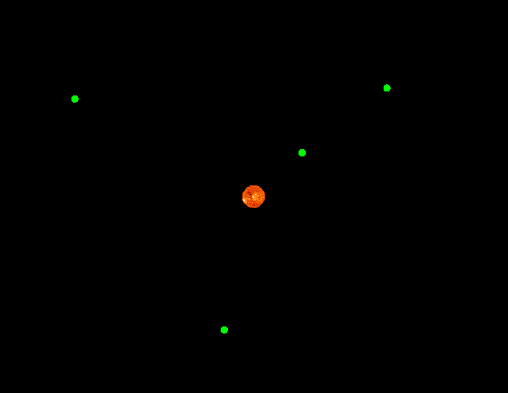

## `-satellite` Satellite Manoeuvres

This simulation simulates satellites being affected by the Earth's gravitational field and derives equations for gravitational force, field strength and potential.
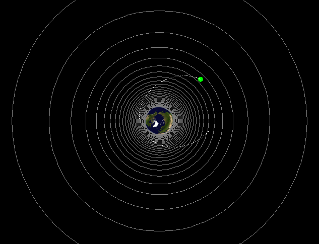

## `-doppler` Doppler Shift

This  simulation simulates electromagnetic waves being emitted from a moving source and derives equations for the Doppler Shift.
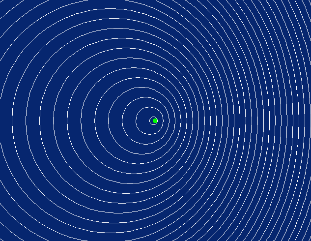

## How to compile (Linux recommended)
*Maven* required.

Clone this repository.

Go to the repository and run
```
mvn package
```
and the `.jar` files are located in `target/`.

## `-orbit` Planetary Orbit

<p>
  The simulation simulates planets orbiting a sun.
  <br>
  This simulation assumes that:
  <ul>
    <li>All planetary orbits are perfectly circular and obeys Kepler's laws</li>
    <li>Only the orbital speed changes and the radius of the orbit is kept the same when the mass of the sun changes</li>
    <li>All planets are particles and have no mass or dimensions</li>
    <li>Planets can pass through each other</li>
  </ul>
</p>

### Interface
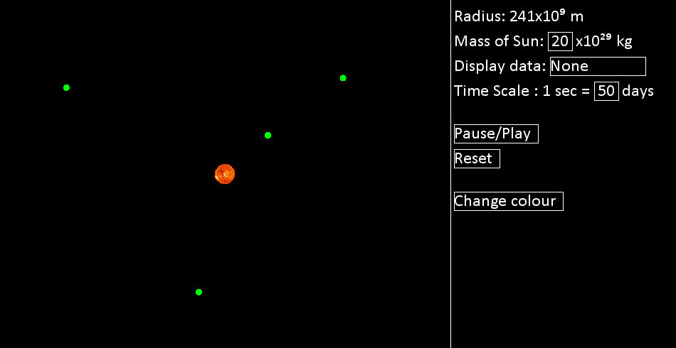
<p>
  The interface in this simulation consist of two sides, the left hand side shows the simulation and the right hand side shows the control panel. The status bar on the browser displays the frame rate the simulation is performing, a frame rate of 60 is considered satisfactory.
</p>

<table>
  <!--Row 1-->
  <tr>
    <!--Column 1-->
      <th>Simulations functions</th>
    <!--Column 2-->
      <th>Diagram</th>
  </tr>
  <!--Row 2-->
  <tr>
    <!--Column 1-->
    <td>
      Left click to create an anti-clockwise orbiting planet.
    </td>
    <!--Column 2-->
    <td>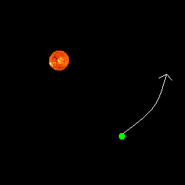</td>
  </tr>
  <!--Row 3-->
  <tr>
    <!--Column 1-->
    <td>
      Right click to create a clockwise orbiting planet.
    </td>
    <!--Column 2-->
    <td>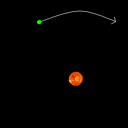</td>
  </tr>
</table>

<br>

<table>
  <!--Row 1-->
  <tr>
    <!--Column 1-->
    <th>Control panel functions</th>
    <!--Column 2-->
    <th>Diagram 1 </th>
    <!--Column 3-->
    <th>Diagram 2</th>
  </tr>
  <!--Row 2-->
  <tr>
    <!--Column 1-->
    <td>
      <b>Radius</b><br></br>
      The distance between the mouse and the centre of the sun is displayed as shown in the diagram 1.
      <br></br>
      Diagram 2 shows how the distance is measured.
    </td>
    <!--Column 2-->
    <td></td>
    <!--Column 3-->
    <td>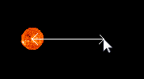</td>
  </tr>
  <!--Row 3-->
  <tr>
    <!--Column 1-->
    <td>
      <b>Mass of the sun</b><br></br>
      The mass of the sun is as shown in diagram 1.
      <br></br>
      It can be edited as shown in diagram 2, click on it and press backspace to delete the variable. Press the number keys to change the variable. Hit enter to return the variable.
    </td>
    <!--Column 2-->
    <td></td>
    <!--Column 3-->
    <td></td>
  </tr>
  <!--Row 4-->
  <tr>
    <!--Column 1-->
    <td>
      <b>Data display</b><br></br>
      The display data drop down menu, diagram 1, allows selected data of each planet to be shown, diagram 2, from the following:-
      <ul>
        <li>Radius of orbit</li>
        <li>Orbit speed</li>
        <li>Centripetal acceleration</li>
      </ul>
    </td>
    <!--Column 2-->
    <td>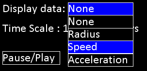</td>
    <!--Column 3-->
    <td>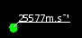</td>
  </tr>
  <!--Row 5-->
  <tr>
    <!--Column 1-->
    <td>
      <b>Time scale</b><br></br>
      The time scale is as shown in diagram 1.
      <br></br>
      It can be edited as shown in diagram 2, click on it and press backspace to delete the variable. Press the number keys to change the variable. Hit enter to return the variable.
    </td>
    <!--Column 2-->
    <td></td>
    <!--Column 3-->
    <td></td>
  </tr>
  <!--Row 6-->
  <tr>
    <!--Column 1-->
    <td>
      <b>Pause/play button</b><br></br>
      The pause/play button will pause or unpause the simulation.
    </td>
    <!--Column 2-->
    <td></td>
  </tr>
  <!--Row 7-->
  <tr>
    <!--Column 1-->
    <td>
      <b>Reset button</b><br></br>
      The reset button will reset the simulation to its initial state.
    </td>
    <!--Column 2-->
    <td></td>
  </tr>
  <!--Row 8-->
  <tr>
    <!--Column 1-->
    <td>
      <b>Change colour button</b><br></br>
      The change colour button changes the colour scheme of the simulation from a selection of :
      <ul>
        <li>Black</li>
        <li>White</li>
        <li>Blue</li>
      </ul>
    </td>
    <!--Column 2-->
    <td></td>
  </tr>
</table>

<!-- Background physics -->
<h3>Background physics</h3>
<p>One of Kepler's laws state that the time of obit squared is directly proportional to the average radius of the orbit cubed, ie 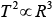. Sir Isaac Newton proved this law by using his equation of circular motion with the equation for gravitational force.</p>
<p>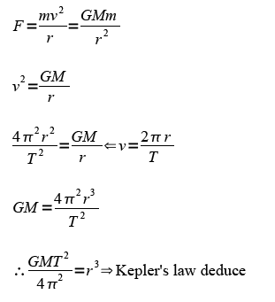</p>
<p>
  This simulation's algorithm is somewhat based on Kepler's law but it is mainly based on Newton's equation of circular motion to find the angular velocity. The angular velocity is then used to change the angular displacement of each planet.
</p>
<p>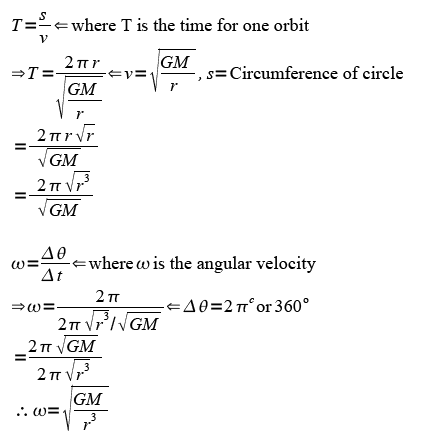</p>
<p>
  So using the equation 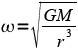, the angular displacement of each planet is updated.
</p>

<br>

<!-- FAQ -->
<h3>Scientific FAQ</h3>

<ul>
  <li>
    Why can't you change the mass of the planet?
    <ul><li>
      The orbital speed does not depend on the mass of the planet, therefore it is not necessary to change the mass of the planet.
    </li></ul>
  </li><br>

  <li>
    Can this simulation be used to model the solar system?
    <ul><li>
      Yes but only the inner solar system planets can be used in this simulation. This is because the scale of the whole of the solar system is so huge that it is impractical to model this.
    </li></ul>
  </li><br>

  <li>
    What should happen if the mass of the sun changes?
    <ul><li>
      If the sun gains mass, it will have more gravitational force which will pulls the planets towards the sun. However as the planets are pulled towards the sun, the planets will convert its gravitational potential energy to kinetic energy and so gain velocity therefore will still be in orbit.
    </li><li>
      However if the sun loses mass, each planet will have less gravitational potential energy as a result of the sun having less gravitational force. Each planets' total energy will increase because of this so each planet may either increase the radius of its orbit or speed up.
    </li><li>
      If the mass of the sun suddenly becomes really small, each planet would travel in a straight line tangent to its orbit at that time.
    </li><li>
      The reason why this simulation is to assume the radius of each orbit is fixed is to simplify the simulation and fully focus on circular orbit.
    </li></ul>
  </li><br>

  <li>
    Are planetary orbits perfectly circular?
    <ul><li>
      No and it doesn't need to be. Most are actually elliptical because planets have orbital speeds slightly different from what is required for a perfect circular orbit.
    </li></ul>
  </li><br>

</ul>

<h3>Technical FAQ</h3>

<ul>
  <li>
    Why can't I create a planet close to the sun?
    <ul><li>
      This simulation won't let you create a planet with an orbit of radius less than 16x10⁹ m.
    </li></ul>
  </li><br>

  <li>
    How do I change the mass of the sun or the time scale?
    <ul><li>
      Click on the number box and it should change colour. Press backspace to delete the digits and type in the desired value by typing in the number keys on the keyboard then press enter. If you have made a mistake, press the backspace button.
    </li></ul>
  </li><br>

  <li>
    How do you see the data for each planet?
    <ul><li>
      The display data drop down menu can be opened by clicking on it. Select the data to be seen by clicking on the options of data.
    </li></ul>
  </li><br>

  <li>
    What's the maximum number of planets which can be created?
    <ul><li>
      There is no limit to how many planets can be created however the simulation will slow down if too many are created.
    </li></ul>
  </li><br>
</ul>

## `-satellite` Satellite Manoeuvres

<p>
  This simulation simulates satellites being effected by the Earth's gravitational field.
  <br>
  This simulation assumes that:
  <ul>
    <li>Each satellite is treated as a particle and has no mass or dimensions</li>
    <li>Total energy is not lost when moving in space</li>
    <li>Satellites can pass through each other</li>
  </ul>
</p>

<h3>Interface</h3>
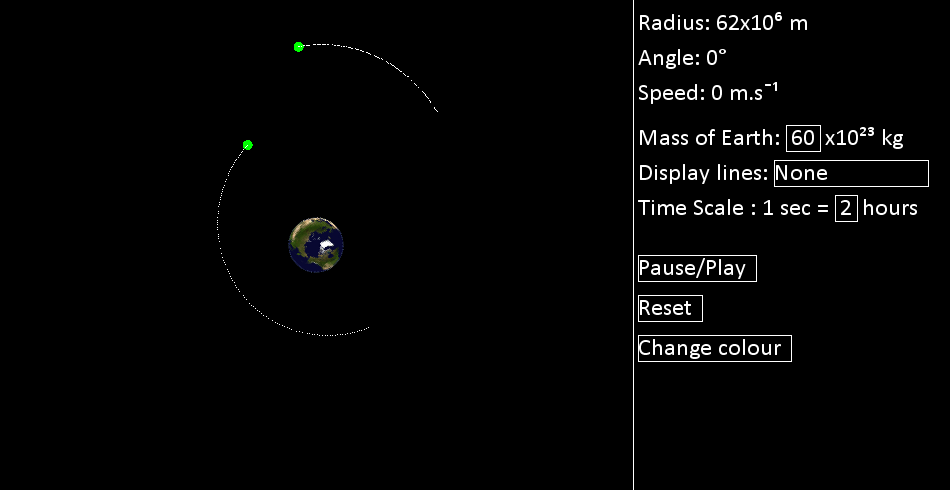
<p>
  The interface in this simulation consist of two sides, the left hand side shows the simulation and the right hand side shows the control panel. The status bar on the browser displays the frame rate the simulation is performing, a frame rate of 60 is considered satisfactory.
</p>

<table>
  <!--Row 1-->
  <tr>
    <!--Column 1-->
      <th>Simulations functions</th>
    <!--Column 2-->
      <th>Diagram 1</th>
  </tr>
  <!--Row 2-->
  <tr>
    <!--Column 1-->
    <td>
      Left click and drag to create the initial velocity vector of the satellite.
    </td>
    <!--Column 2-->
    <td>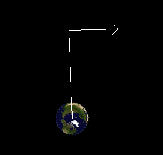</td>
  </tr>
  <!--Row 3-->
  <tr>
    <!--Column 1-->
    <td>
      Release the mouse after dragging to create the satellite. The satellite will create a trail of white dots during its orbit.
    </td>
    <!--Column 2-->
    <td>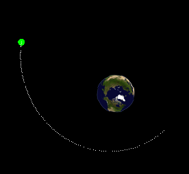</td>
  </tr>
</table>

<br>

<table>
  <!--Row 1-->
  <tr>
    <!--Column 1-->
    <th>Control panel functions</th>
    <!--Column 2-->
    <th>Diagram 1 </th>
    <!--Column 3-->
    <th>Diagram 2</th>
  </tr>

  <!--Row 2-->
  <tr>
    <!--Column 1-->
    <td>
      <b>Initial velocity vector information</b><br></br>
      The initial velocity vector is created when the mouse is dragged as shown in Diagram 1.
      <br></br>
      Diagram 2 shows the information of the initial velocity vector.
    </td>
    <!--Collumn 2-->
    <td>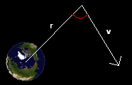</td>
    <!--Collumn 3-->
    <td>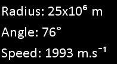</td>
  </tr>
  <!--Row 3-->
  <tr>
    <!--Column 1-->
    <td>
      <b>Mass of the Earth</b><br></br>
      The mass of the Earth is shown as shown in diagram 1.
      <br></br>
      It can be edited as shown in diagram 2, click on it and press the number keys to change the variable. Hit enter to return the variable.
    </td>
    <!--Column 2-->
    <td></td>
    <!--Column 3-->
    <td></td>
  </tr>
  <!--Row 4-->
  <tr>
    <!--Column 1-->
    <td>
      <b>Force lines</b><br></br>
      Force lines shows the lines of force as displayed in diagram 1.
      <br></br>
      It can be selected in the drop down menu as shown in diagram 2.
    </td>
    <!--Column 2-->
    <td>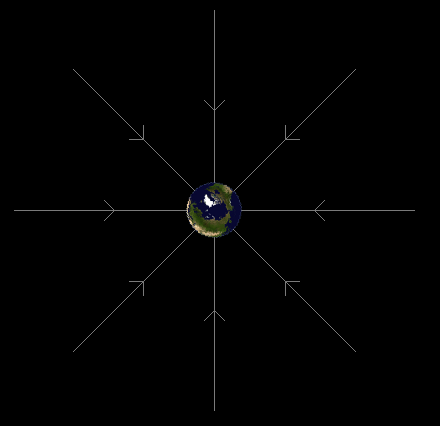</td>
    <!--Column 3-->
    <td></td>
  </tr>
  <!--Row 5-->
  <tr>
    <!--Column 1-->
    <td>
      <b>Equipontentials</b><br></br>
      Equipontentials shows where gravitational potential is the same as shown in diagram 1. Each equipontential shows increments of 1 x10⁶ J.kg¯¹.
      <br></br>
      It can be selected in the drop down menu as shown in diagram 2.
    </td>
    <!--Column 2-->
    <td>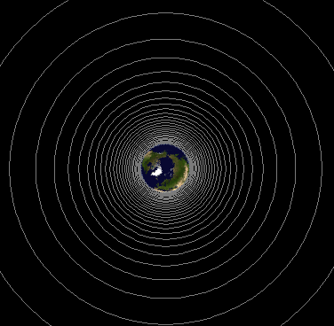</td>
    <!--Column 3-->
    <td></td>
  </tr>
  <!--Row 6-->
  <tr>
    <!--Column 1-->
    <td>
      <b>Time scale</b><br></br>
      The time scale is shown as shown in diagram 1.
      <br></br>
      It can be edited as shown in diagram 2, click on it and press the number keys to change the variable. Hit enter to return the variable.
    </td>
    <!--Column 2-->
    <td></td>
    <!--Column 3-->
    <td></td>
  </tr>
  <!--Row 7-->
  <tr>
    <!--Column 1-->
    <td>
      <b>Pause/play button</b><br></br>
      The pause/play button will pause or unpause the simulation.
    </td>
    <!--Column 2-->
    <td></td>
  </tr>
  <!--Row 8-->
  <tr>
    <!--Column 1-->
    <td>
      <b>Reset button</b><br></br>
      The reset button will delete all satellites in the simulation.
    </td>
    <!--Column 2-->
    <td></td>
  </tr>
  <!--Row 9-->
  <tr>
    <!--Column 1-->
    <td>
      <b>Change colour button</b><br></br>
      The change colour button changes the colour scheme of the simulation from a selection of :
      <ul>
        <li>Black</li>
        <li>White</li>
        <li>Blue</li>
      </ul>
    </td>
    <!--Column 2-->
    <td></td>
  </tr>
</table>


<h3>Background physics (Gravitational force)</h3>

<p>
  One of Sir Isaac Newton's law is the inverse square law. It says that the force from a source is proportional to one over r squared, ie ; this is because the lines of force spread out and the area it affects increases quadratically.
</p>

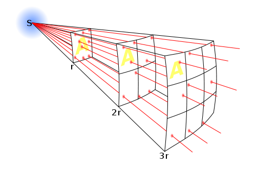

<p>
  The image above shows the lines of force being spread out, creating a field. The area which is affected by the force is the distance from the force squared. Also the force decreases as it moves away from the source and hence explains why the proportionally is an inverse.
</p>

<p>
  Gravitational force obeys Newton's inverse square law because the lines of gravitational force also spreads out. From this it is possible to derive an equation for gravitational force, between mass M and m, and acceleration due to gravity if all mass has a gravitational force.
</p>

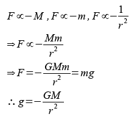

<p>
  Where G is the gravitational force constant 6.67 x10¯¹¹ N.m².kg¯² and g is the gravitational field strength or the acceleration due to gravity.
</p>


<p>
  This simulation uses this equation but resolves them into vector components to make calculations easier for the computer.
</p>

<h2>Background physics (Gravitational potential)</h2>

<p>
  Gravitational potential energy is the work done against gravity. Using the equation work = Fx and F = mg, the equation for gravitational potential energy can be derived.
</p>

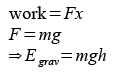

<p>
  This equation is fine for small changes of the height because the value of g, the gravitational field strength, is almost always constant. However once height has increased so much, the value of g will change a lot at different distances from the Earth so this equation becomes invalid. To derive a new equation by considering the change in the gravitational field strength over large distances, the equation for the gravitational field strength derived from Newton's inverse square law is substituted into the equation for gravitation potential energy.
</p>

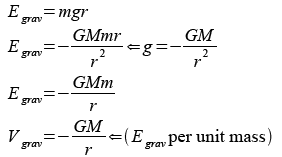

<p>
  Objects going through a change in distance from the Earth will have a change in gravitational potential and this change will change the kinetic energy of the object.
</p>

<p>
  Notice there is a slight similarity with the equation for gravitational potential and the gravitational field strength, only the power of r is different. From this, calculus can be used to find the relationship between gravitational potential and gravitational field strength.
</p>

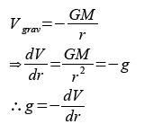

<p>
  From this it is derived that the gravitational field strength is the change in gravitational potential over the change in distance. In other words the gradient of the graph 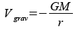 is the gravitational field strength as shown below.
</p>

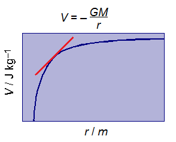

<p>
  Using integration, more relationships can be derived.
</p>

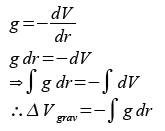

<p>
  From this the change in gravitational potential is the area between the curve 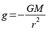, the x axis and the two values of r as shown below.
</p>

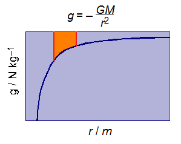

<h3>Scientific FAQ</h3>

<ul>
  <li>
    What are equipontentials?
    <ul><li>
      They are lines where the gravitational potential are the same, they can be compared as contour lines in a geographical map. The closer the equipontentials are, the more change in gravitational potential there which means more gravitational field strength hence more acceleration.
    </li></ul>
    <ul><li>
      By drawing the equipontentials, the simulation looks like a 'well' so a cross of it will look like a curve. The steepness of the curve is actually equal to the acceleration due to gravity.
    </li></ul>
  </li><br>

  <li>
    How do you make a satellite orbit?
    <ul><li>
      For a circular orbit its initial velocity must be perpendicular to the radius of the Earth, ie 90 degrees, and the magnitude must equal to the speed required for circular orbit depending on the mass of the earth and the distance from the centre of the earth.
    </li></ul>
    <ul><li>
      If the initial velocity is slightly different from what is required for circular orbit, its orbit could be elliptical.
    </li></ul>
  </li>
</ul>

<h3>Technical FAQ</h3>

<ul>
  <li>
    How do I change the mass of the Earth or the time scale?
    <ul><li>
      Click on the number box and it should change colour. Type in the desired value by typing in the number keys on the keyboard then press enter. If you have made a mistake, press the backspace button.
    </li></ul>
  </li><br>

  <li>
    What's the maximum number of satellites which can be created?
    <ul><li>
      There is no limit to how many satellites can be created however the simulation will slow down if too many are created.
    </li></ul>
  </li><br>

  <li>
    How do you see the force/equipotential lines?
    <ul><li>
      The display lines drop down menu can be opened by clicking on it. Select the lines to be seen by clicking on the type of lines to be displayed.
    </li></ul>
  </li><br>

</ul>

## `-doppler` Doppler Shift</h2>

<p>
  This simulation models electromagnetic waves being emitted from a moving source. Each wave front is represented as a line. Because this is a model, the frequency of the wave front emitted is not to scale.
</p>

<h3>Interface</h3>
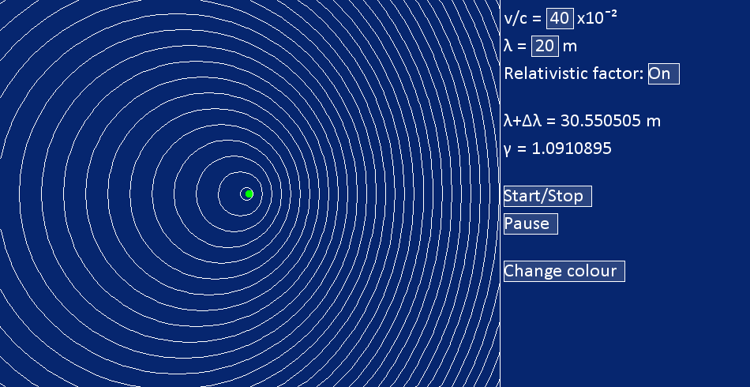
<p>
  The interface in this simulation consist of two sides, the left hand side shows the simulation and the right hand side shows the control panel. The status bar on the browser displays the frame rate the simulation is performing, a frame rate of 60 is considered satisfactory.
</p>

<table>
  <!--Row 1-->
  <tr>
    <!--Column 1-->
      <th>Simulations functions</th>
    <!--Column 2-->
      <th>Diagram 1</th>
  </tr>
  <!--Row 2-->
  <tr>
    <!--Column 1-->
    <td>
      The source of radiation is represented as a green spot.
    </td>
    <!--Column 2-->
    <td></td>
  </tr>
  <!--Row 3-->
  <tr>
    <!--Column 1-->
    <td>
      Wave fronts are represented as lines. This is where a part of the wave goes through one full phase rotation.
    </td>
    <!--Column 2-->
    <td></td>
  </tr>
</table>

<br>

<table>
  <!--Row 1-->
  <tr>
    <!--Column 1-->
    <th>Control panel functions</th>
    <!--Column 2-->
    <th>Diagram 1 </th>
    <!--Column 3-->
    <th>Diagram 2</th>
  </tr>

  <!--Row 2-->
  <tr>
    <!--Column 1-->
    <td>
      <b>Speed of the source</b><br></br>
      The speed of the source over the speed of light is as shown in diagram 1.
      <br></br>
      It can be edited as shown in diagram 2, click on it and press the number keys to change the variable. Hit enter to return the variable.
    </td>
    <!--Collumn 2-->
    <td></td>
    <!--Collumn 3-->
    <td></td>
  </tr>
  <!--Row 3-->
  <tr>
    <!--Column 1-->
    <td>
      <b>Wavelength of the magnetic radiation</b><br></br>
      The wavelength of the magnetic radiation is as shown in diagram 1.
      <br></br>
      It can be edited as shown in diagram 2, click on it and press the number keys to change the variable. Hit enter to return the variable.
    </td>
    <!--Column 2-->
    <td></td>
    <!--Column 3-->
    <td></td>
  </tr>
  <!--Row 4-->
  <tr>
    <!--Column 1-->
    <td>
      <b>Relativistic factor</b><br></br>
      The relativistic can be considered or ignored in this simulation by turning it on or off. The value of the relativistic factor is as shown in diagram 1.
      <br></br>
      It can be turned on or off in the drop down menu as shown in diagram 2.
    </td>
    <!--Column 2-->
    <td>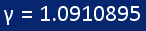</td>
    <!--Column 3-->
    <td></td>
  </tr>
  <!--Row 5-->
  <tr>
    <!--Column 1-->
    <td>
      <b>Stretched wavelength</b><br></br>
      The length of the stretched wavelength is as shown in diagram 1.
    </td>
    <!--Column 2-->
    <td></td>
  </tr>
  <!--Row 6-->
  <tr>
    <!--Column 1-->
    <td>
      <b>Start/stop button</b><br></br>
      The start/stop button will start or stop the simulation.
    </td>
    <!--Column 2-->
    <td></td>
  </tr>
  <!--Row 7-->
  <tr>
    <!--Column 1-->
    <td>
      <b>Pause/play button</b><br></br>
      The pause/play button will pause or unpause the simulation.
    </td>
    <!--Column 2-->
    <td></td>
  </tr>
  <!--Row 8-->
  <tr>
    <!--Column 1-->
    <td>
      <b>Change colour button</b><br></br>
      The change colour button changes the colour scheme of the simulation from a selection of :
      <ul>
        <li>Black</li>
        <li>White</li>
        <li>Blue</li>
      </ul>
    </td>
    <!--Column 2-->
    <td></td>
  </tr>
</table>


<h3>Background physics</h3>

<p>
  The Doppler effect or Doppler shift is the result of a wave emitting source to move causing the wavelength of the wave to stretch or compress. Waves being stretched are known to undergo red shift as their wavelengths has increased towards the red end of the spectrum. The factor of Doppler shift can be derived as shown below.
</p>

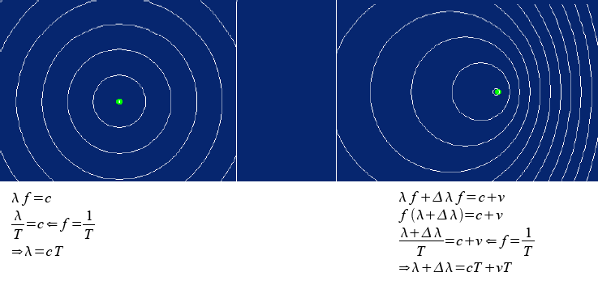
<br>
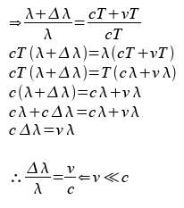

<p>
  The equation derived is know as the Doppler shift factor and it is used to work out how much the wavelength has been stretched. Notice v has to be much smaller than c because time dilation happens when approaching the speed of light, this is where the rate of time slows down so the waves rotating phasors rotate slower and so their wavelengths are stretched even more. The Doppler shift factor ignores time dilation so v has to be smaller than c for the factor to work.
</p>

<p>
  To work out how long is the stretched wavelength considering time dilation, the relativistic factor is used and it is to be multiplied to the length of the overall stretched wavelength worked out by using the Doppler shift factor as shown below.
</p>

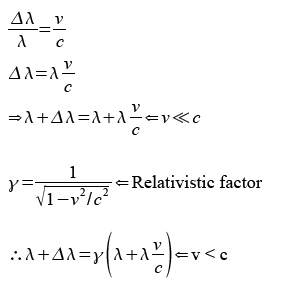

<p>
  The simulation also uses the same equation as above to work out the length of the stretched wavelength. Try and get the same results using your calculator.
</p>

<h3>Scientific FAQ</h3>

<ul>
  <li>
    What so important about the Doppler Shift?
    <ul><li>
      It is important because ALL galaxies emit red shift or waves which are stretched. This means all galaxies are moving away from us and using the Doppler Shift factor enable us to work out how fast they are receding away from us.
    </li>
    <li>
      Because all galaxies are receding away from us it meant all the galaxies came from one place so the Big Bang theory was concluded.
    </li></ul>

  </li><br>

  <li>
    Why is time dilated when approaching the speed of light?
    <ul><li>
      Time dilation is the result of the speed of light always being constant no matter the velocity of the observer is.
    </li></ul>
  </li><br>

  <li>
    What is the point of turning the relativistic factor on and off?
    <ul><li>
      It helps you to compare how much the relativistic factor has an effect on the stretched wavelength when approaching the speed of light. By entering v/c = 0.99 into the simulation, the value of γ reaches a magnitude of 7!
    </li></ul>
  </li>
</ul>

<h3>Technical FAQ</h3>

<ul>
  <li>
    Why won't the simulation start?
    <ul><li>
      You need to press the Start/Stop button to start the simulation.
    </li></ul>
  </li><br>

  <li>
    How do I change the variables in the control panel?
    <ul><li>
      Click on the number box and it should change colour. Type in the desired value by typing in the number keys on the keyboard then press enter. If you have made a mistake, press the backspace button.
    </li></ul>
  </li><br>

  <li>
    Why is my calculator result slightly different from the simulation result?
    <ul><li>
      Sometimes there will be a rounding error when the simulation converts binary to deanery. If your answer is around the same magnitude, you more or less have the correct answer.
    </li></ul>
  </li><br>
</ul>
